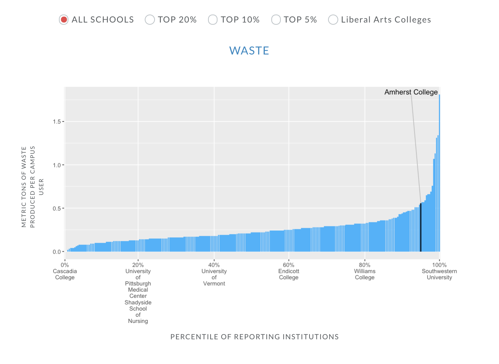

```{r setup, include = FALSE}
library(tidyverse)
library(kableExtra) 
library(janitor)
library(tidytext)
library(wordcloud)
library(textdata)
library(robotstxt) 
library(rvest) 
library(purrr) 
library(readxl)
library(readr)
library(fuzzyjoin)
library(readxl)
library(leaflet)
library(gganimate)
library(transformr)
library(gifski)
library(png)


# Set code chunk defaults 
knitr::opts_chunk$set(echo = FALSE, 
                      mesage = FALSE,
                      warning = FALSE,
                      fig.align = "center")

# Set R environment options
options(knitr.kable.NA = '')
```

# Motivations

As an extension of our [Shiny project](https://sazhu24.shinyapps.io/SHINY/?_ga=2.39471459.1743845453.1638909670-2119895326.1632228173), our blog project continues to investigate how Amherst College embodies principles of sustainability and looks at the broader trajectory of sustainability throughout higher education in the US. By analyzing Amherst's expressed sentiment and benchmark measures of performance in a national context, our blog is designed to help students, faculty, and administration hold our campus accountable. We hope to ultimately share our blog with Amherst's incoming director of sustainability to highlight areas with the greatest potential for growth, and to promote collaboration across institutions.

# Sustainability Report Sentiment Analysis

For the sentiment analysis section of our project, I (Gillian) scraped Amherst College's most recent sustainability report from 2017, which can be accessed [here](https://www.amherst.edu/amherst-story/today/green-amherst/reporting-and-operations/sustainability-reports/report-october-2017) through R code. I needed to be able to convert it into a data frame in R, which is why I scraped it. It is a .txt file with one string which I tokenized into words, removed the stop words, and counted the word frequencies to use in my sentiment analysis. We wanted to examine the sentiments found in this report because it will provide insight on how the college's administration discusses issues surrounding sustainability. 

```{r, message = FALSE}
#Read in sustainability report
report <- read_csv("sentimentanalysis/data/amherstsustainabilityreport.txt")

#Stop word data
data(stop_words)

#Wrangling
word_tokenized <- report %>%
  #Tokenize text into words
  unnest_tokens(output = word, input = x) %>%
  #Remove stop words
  anti_join(stop_words, by = "word") 

  #Word frequencies
word_frequencies <- word_tokenized %>%
  count(word, sort = TRUE) 
```

## Common Words

First, I created a common words plot that displays the top ten most common words in the report using the word frequency data set I created. This plot shows that investment was the most common word in the report, being written 30 times. This is interesting because it shows the institution views investment and money as very important factors when considering sustainability policy. I also created a word cloud that displays words with a minimum frequency of 5 and colors and sizes them from least to most frequent. 

```{r, warning = FALSE}
#Common words plot
word_frequencies %>%
  slice(1:10) %>%
  ggplot(aes(x = reorder(word, n), y = n, 
             color = word, fill = word)) +
  geom_col() +
  coord_flip() +
  guides(color = "none", fill = "none") +
  labs(x = NULL,
       y = "Number of instances",
       title = "The Most Common Words in Amherst's Sustainability Report") +
  theme(axis.text = element_text(size = 15))

#Word Cloud
mypal <- brewer.pal(10, "Paired")

wordcloud(words = word_frequencies$word, 
          freq = word_frequencies$n,
          min.freq = 5,
          max.words = 50,
          # plot the words in a random order
          random.order = TRUE,
          # specify the range of the size of the words
          scale = c(2, 0.3),
          # specify proportion of words with 90 degree rotation
          rot.per = 0.15,
          # colors words from least to most frequent
          colors = mypal,
          # font family
          family = "sans")
```

## NRC Lexicon

Next, I examined three different lexicons to try and summarize the sentiments in the report. First is the NRC Lexicon which categorizes words by emotions. I created a visualization that displays all of the emotions sorted with the lexicon and the words with the highest contribution to those sentiments. Some notable aspects from this visualization include that the fear emotion included the word change 10 times and the trust and joy emotions included a large variety of words while emotions like sadness and disgust had many less words. This provides some context about how Amherst talks about sustainability coming more from a positive place with change rather than a place of fear or distrust.

```{r, fig.height = 7}
#NRC Lexicon
nrc_lexicon <- get_sentiments("nrc")

#Make dataset
nrc_lexicon_formatted <- inner_join(nrc_lexicon, word_frequencies, by = c("word" = "word"))

#Create data for visualization for top words in each emotion
nrc_graphic <- nrc_lexicon_formatted %>%
  filter(sentiment %in% c("anger", "anticipation", "disgust", "sadness", "fear", "joy", "surprise", "trust")) %>%
  group_by(sentiment) %>%
  arrange(desc(n)) %>%
  slice(1:10) %>%
  ungroup() 

#Create visualization for top words in each emotion
nrc_graphic %>%
  ggplot(aes(x = reorder(word, n), y = n, 
             fill = sentiment)) +
  geom_col(show.legend = FALSE) +
  coord_flip() +
  facet_wrap(~ sentiment, ncol = 2, scales = "free_y") +
  labs(x = NULL,
       y = "Contribution to sentiment",
       title = "The most common sentiments in Amherst's Sustainability Report, NRC") +
theme(axis.text = element_text(size = 10))
```

## AFINN Lexicon

Next, I created a visualization with the AFINN lexicon which looks at negative versus positive words with an integer between 5 and -5. The highest integer on this visualization is 3 with the word successful. However, the overall trend shows words with positive integers (positive words) with values between 1 and 2. I used the tokenized word data set rather than the word frequencies to calculate the average sentiment value. The average was 1.297, which shows the average sentiment in the sustainability report was slightly positive. Therefore, Amherst is talking about sustainability with generally slightly positive terms and very few negative terms. I also created a histogram to show the distribution of sentiments using this Lexicon and plotted a line for the average sentiment value. This again shows that the report was slightly positive, which makes sense since Amherst would want to shine a positive light on their sustainability practices.

```{r, include = FALSE}
#AFINN Lexicon
afinn_lexicon <- get_sentiments("afinn")

#Create data set with tokenized words
afinn_lexicon_formatted <- inner_join(afinn_lexicon, word_tokenized, by = c("word" = "word"))

#Calculate mean sentiment
mean(afinn_lexicon_formatted$value)
```

```{r, , fig.width = 6}
#Create histogram of sentiment distribution
ggplot(afinn_lexicon_formatted, aes(x = value)) +
  geom_histogram(binwidth = 1, color = "black", fill = "lightblue") +
  labs(x = "Frequency",
       y = "Sentiment Value",
       title = "Sentiment Distribution, AFINN") +
  geom_vline(aes(xintercept = mean(value)),
            color = "blue", linetype = "dashed", size = 1)
```

## BING Lexicon

Lastly, I looked at the BING Lexicon which just sorts words into negative or positive. A visualization would not be very helpful here since it is only two categories so I calculated the average sentiment of the whole report. To do this, I mutated the sentiments so that if it was positive, it would be a 1 and if it was negative it would be -1. Therefore, a neutral report would get a sentiment of 0. Then, I calculated the mean score of the words and got .71698. This shows that the report is on the more positive side of the BING Lexicon, which aligns with the findings from the other sentiments discussed above.

```{r, message = FALSE, include = FALSE}
#BING Lexicon
bing_words <- word_tokenized %>%
  inner_join(get_sentiments("bing")) %>%
  ungroup() 

#Create data set with tokenized words
bing_lexicon_average <- bing_words %>%
  mutate(sentiment = ifelse(sentiment == "positive", 1, -1))

#Calculate the mean sentiment
mean(bing_lexicon_average$sentiment)
```

## Conclusions

The overall conclusion I drew from my sentiment analysis is that Amherst talks about sustainability from an overall positive viewpoint and tries to limit its use of negative words. There are some limitations to this conclusion. First, I only used the sustainability report Amherst published in 2017. Therefore, this is a very limited view into Amherst College's sentiments surrounding sustainability and is outdated, however, there is not a more recent report. Therefore, the population this can be applied to is very limited and the results can not be generalized beyond Amherst College within the last few years. Although the scope of this analysis is small, it is purposeful to pinpoint how the institution of our own college has recently talked about the issue of sustainability. This analysis could be extended by including all past reports, or broadening the scope to include other colleges. 

# Sustainability on A National Level

## Sustainability Degrees Awarded Across Colleges Nationwide as a Proxy for Sustainability

We also wanted to visualize how different universities across the United States prioritize educating their students on sustainability-related disciplines. Therefore, we used data collected from [datausa](https://datausa.io/profile/cip/sustainability-studies#about) on the amount of Sustainability Studies degrees awarded to students across institutions between 2013-2019 with 1014 total measurements of Sustainability Studies completions across these years. In order to consider differing sizes of the undergraduate class across institutions, these degree completions were divided by 1/4 the number of undergraduate students during Fall 2020 from the [National Center for Education Statistics](https://nces.ed.gov/ipeds/SummaryTables/report/202?templateId=20202&year=2020&expand_by=0&tt=institutional&instType=2). This ratio was then multiplied by 100 to calculate the percent of Sustainability Studies degrees awarded for each graduating year. We also collected out-of-state tuition data for these institutions using data from [datausa](https://datausa.io/profile/cip/sustainability-studies#about) to examine the relationship between sustainability degrees awarded for a given graduating class and the tuition cost. Latitude and longitude data for the institutions was collected using the `colleges` dataset to create the interactive map below.

## Sustainability Studies degree and college tuition map 

```{r, message = FALSE}
#Reading in sustainability studies data
Institutions <- read_csv("data/Institutions.csv") %>%
  janitor::clean_names()
Tuition <- read_csv("data/Tuition Costs for Common Institutions.csv")  %>%
  janitor::clean_names()
colleges <- read_csv("data/ipeds_directory_info.csv") %>%
  janitor::clean_names() %>%
  rename("institution" = "institution_name")

#Creating joined dataset with tuition and degree completions

joined_uni <- left_join(Tuition, Institutions, by = c("id_university", "year"))

#Wrangling joined_uni data 
#Did not include the total graduates column
#because there was no documentation on what the data means
clean_joined_uni <- joined_uni %>%
  select(id_university, 
         university.x, 
         year, 
         out_of_state_tuition, 
         completions) %>%
rename("institution" = "university.x")

#Joining tuition and degree completion data with colleges data
fuzzy_uni <- stringdist_left_join(clean_joined_uni, colleges, by = "institution")

#Wrangling joined dataset to prepare for creating map figure
uni_map <- fuzzy_uni %>%
  filter(!institution.x %in% c("Jefferson (Philadelphia University + Thomas Jefferson University)",
"Messiah University",
"Lyndon State College")) %>%
  rename("long" = longitude_location_of_institution_hd2019,
         "lat" = latitude_location_of_institution_hd2019) %>%
  select(id_university, 
         institution.x, 
         year, 
         out_of_state_tuition,
         completions,
         long,
         lat)

#Reading in class size data to calculate percent degrees awarded
Summary_Tables <- read_excel("data/Summary Tables.xlsx")

#Wrangling class size data so can join with the enrollment map later
Summary_Tables <- Summary_Tables[-c(1:4),] %>%
  janitor::clean_names() %>%
  rename("institution" = "x2", 
         "id_university" = "national_center_for_education_statistics",
         "enrollment_type" = "x3",
         "total_enrollment" = "x4")

enrollment <- Summary_Tables %>%
  select(institution, 
         id_university, 
         enrollment_type, 
         total_enrollment) %>%
  #just want the undergrad
  filter(enrollment_type == "Undergraduate Enrollment",
         !total_enrollment == "-") %>%
  mutate(id_university = parse_double(id_university),
         total_enrollment = parse_double(total_enrollment))
#Joining the tuition and completion data with the class size data
enroll_map <- left_join(uni_map, 
                        enrollment, 
                        by = "id_university") %>%
  #Creating new column to represent the percentage of each graduating class 
  #that receives a Sustainability Studies degree
  mutate(percentdegree = (completions/(total_enrollment/4)*100)) %>%
  #filtering out rows that did not produce percent degree
  #filtering out percent degrees greater than 100
  filter(!is.na(percentdegree),
         percentdegree < 100) 
  
#Creating color palette based on min. and max. percent degree
pal <- colorBin(
  palette = 'Dark2',
  domain = enroll_map$percentdegree,
  bins = c(0, .1, .3, .6, .9, 1.1, 
           1.5, 2, 2.5, 5, 6, 10, 20, 30)
)
#Creating
leaflet(data = enroll_map) %>%
  addTiles() %>%
  addCircleMarkers(lat = ~lat, 
                   lng = ~long, 
                   popup = ~ paste0("Institution: ", institution.x, 
                                    ";",
                                    " Percent degree completions: ",
                                    percentdegree,
                                    "%;", 
                                    "\nOut of state tuition: $",
                                    out_of_state_tuition), 
                   weight = 1,  
                   color=~pal(percentdegree), 
                   radius = ~out_of_state_tuition/10000) %>%
  addLegend("bottomright", pal = pal, values = ~percentdegree,
    title = "Percent sustainability degree",
    labFormat = labelFormat(suffix = "%"),
    opacity = 1
  )
```

To investigate the spatial distribution of percent degrees awarded, we created an interactive map with the color of the points indicating the percent of all graduating undergraduate students for a given year between 2013 and 2019 that were awarded the Sustainability Studies degree. The sizes of the points are scaled by the out of state tuition. This plot allows the user to zoom into different colleges to geographically visualize percent degrees awarded and the out of state tuition. This allows the user to check how a given college, including their college, compares to other colleges' percent Sustainability Studies degrees awarded. The user can then take this information to hold their campuses accountable for providing education opportunities for those interested in Sustainability Studies.

## Relationship between Sustainability Studies degrees awarded and college tuition

We then wanted to explore the relationship between the college's prioritization of the Sustainability Studies department and the out-of-state tuition. We hypothesized that colleges with higher tuition would have higher percent Sustainability Studies degree completions because schools with higher tuition could have the finances to expand their degree options to Sustainability Studies and provide more support and resources to this department.

```{r, message = FALSE}
#creating scatterplot to investigate relationship between percent sustainability and the out of state tuition

ggplot(data = enroll_map, aes(y = log(log(percentdegree + 1)), 
                              x = out_of_state_tuition)) +
  geom_point(aes(color = institution.x)) + 
  theme(legend.position = "none") + 
  ggtitle("Transformed percent Sustainability Studies completions\ncompared to out of state tuition in ten thousands of dollars") + 
  xlab("Out of State Tuition (ten thousands of dollars)") + 
  ylab ("Transformed % Sustainability Studies degrees\n(log-log transformed)") + 
  theme(plot.title = element_text(size = 18),
      axis.title.y = element_text(size = 14),
      axis.title.x = element_text(size = 14),
      axis.text = element_text(size = 12))
```

Percent completions of the Sustainability Studies degree were transformed in order to visualize the relationship. The points at the bottom of the scatterplot represent colleges with 0% Sustainability Studies completions. There appears to be no relationship between the percent completions and the tuition. This suggests that tuition may not affect the college's prioritization of Sustainability Studies. This is a positive result because it seems that tuition cost may not limit students' access to the Sustainability Studies degree.

## Change in degrees awarded over time

We also wanted to investigate the trend of Sustainability Studies degrees awarded as a proxy of institutions' changing prioritization of educating their students on sustainability over time.

```{r, message = FALSE}
#dynamic histogram to see if the percent sustainability degrees differ over time
#transforming year to become integer so can round anim. plot to year
enroll_map <- enroll_map %>%
  mutate(year = as.integer(year))

#making the animation plot
anim_plot <- ggplot(enroll_map, aes(log(log(percentdegree + 1)))) + 
  geom_density(col = "black",
               fill = "blue") + 
  ggtitle("{frame_time}") + 
  theme(plot.title = element_text(size = 24)) + 
  xlab("Transformed percent degree completions(log-log transformed)") + 
  theme(axis.title.x = element_text(size = 20),
        axis.title.y = element_text(size = 20),
        axis.text = element_text(size = 14)) +
  transition_time(year) + 
  shadow_mark(alpha = .3) + 
  ease_aes("linear") +
  enter_fade() +
  exit_fade()

animate(anim_plot, width = 700, height = 450)
```

Between 2013 and 2019 there appears to be first an increase in the density of colleges which documented Sustainability Studies completions, and these completions tend to be at lower percentages. However, this result is most likely because there are less data for 2013 than the other years. Notably, however, the density plot shifts to higher percentages of completions from 2013-2019, which could suggest that institutions are starting to prioritize educating their students on Sustainability-related topics.

## How well do Sustainability Studies completions measure sustainability?

We sought to compare the top 10 colleges with the highest percent Sustainability Studies degrees to the top 10 school ranked based on green power usage to determine how using Sustainability Studies degree completions as a proxy for sustainability of a college compares to other measurements of sustainability. 

We used data from the [EPA](https://www.epa.gov/greenpower/green-power-partnership-top-30-college-university) which ranked the top most sustainable colleges and universities in terms of the amount of green power they use. 

## Top 10 schools using the most green power

Below is a table ranking the top 10 most sustainable colleges in terms of green energy usage.

```{r, message = FALSE}
#comparing the top 10 %completions to top 10 green power users

#Top 10 in terms of Green Power for 2019
Top10 <- read_excel("data/Top30.xlsx") %>%
  rename("Green Power Proportion of Total Energy Used" = "...4") %>%
  select(Institution, 
         `Green Power (kWh)`,
         `Green Power Proportion of Total Energy Used`) %>%
  slice(1:10)
knitr::kable(Top10)  
```

## Top 10 schools with the most Sustainability Studies degree completions

Below is a table ranking the top 10 colleges with the highest number of Sustainability Studies completions.

```{r, message = FALSE}

#creating enrollment ranking for 2019 to compare to top 10 green power users
enroll2019 <- enroll_map %>%
  filter(year == "2019") %>%
  select(institution.x, 
         year, 
         percentdegree)

#Top 10 in terms of percent Sustainability Studies completions
Top10degree <- enroll2019 %>%
  filter(institution.x != "SIT Graduate Institute") %>%
  mutate(percentdegree = round(percentdegree, 2)) %>%
  distinct() %>%
  arrange(desc(percentdegree)) %>%
  slice(1:10) %>%
  select(institution.x, percentdegree) %>%
  rename("Institution" = "institution.x",
         "Percent Sustainability Studies completions" = "percentdegree") 
knitr::kable(Top10degree)

```

There does not appear to be any overlap between the ranked schools in the two tables. This is interesting because it suggests that different schools have different aspects of sustainability to offer.

## Conclusions from Sustainability Studies Degree Analysis

From our analysis of the sustainability studies degrees awarded, the interactive map allows the user to check how a specific school of interest prioritizes Sustainability Studies. Overall, it seems that there is little relationship between sustainability studies degrees awarded and the tuition cost. According to the density plot, there appears to be a rise in sustainability studies degrees awarded, which is exciting! Lastly the Sustainability Studies degree completions does not determine a school's "sustainability." It is necessary to consider many different factors in order to generate a more comprehensive survey of college's sustainability. Gathering informative and accurate data is important in our mission to push our college and other colleges nationwide to act more sustainably and teach students to continue these sustainable habits when they graduate.

There are limitations in these analyses since percent completions were calculated using the completions and the number of graduates from different sources. We filtered out percent completions that were over 100%, meaning that the completions were greater than 1/4 the students who were undergraduates in Fall 2020. This could happen if during a given year, the actual number of undergraduate students was greater than the number of undergraduates in Fall 2020. In the future, I would use the data from the same year for number of graduates each year and completions to calculate percent completions.


# STARS Interactive Map

## STARS Database

After examining Amherst's expressed commitment to sustainability, and sustainability as a growing field in higher education, we wanted to develop a tool to visualize our college's performance, and more importantly, to understand how Amherst compares to other institutions using a common set of benchmarks.

Our project recognizes the unique challenges, constraints, and opportunities facing colleges and universities in the U.S. today, and created these interactive features with the goal of aiding strategic planning and fostering cross-sector dialogue about sustainability on campus.

We ended up scraping the entire [STARS Database](https://stars.aashe.org/) of higher education institutions in the US, including individual report card components and responses spanning several web pages for each institution. We spent a significant amount of time compiling the final database, relying on a variety of for loops, selectors, mutation methods, and other wrangling tactics. The following code chunk demonstrates how we scraped each unique response variable displayed in our leaflet map:

```{r, echo = TRUE, eval = FALSE}
# list of XML selectors for different scraped response item (e.g. percentage of course offerings that focus on sustainability)
elements <- c("/html/body/div/main/div/div/main/div/div/div/section/div/div[2]/div/div[2]/text()",
              "/html/body/div/main/div/div/main/div/div/div/section/div/div[2]/div/div[4]/text()",
              "/html/body/div/main/div/div/main/div/div/div/section/div/div[2]/div/div[15]",
              "/html/body/div/main/div/div/main/div/div/div/section/div/div[2]/div/table[5]/tbody/tr/td[2]",
              "/html/body/div/main/div/div/main/div/div/div/section/div/div[2]/div/table[4]/tbody/tr/td[2]",
              "/html/body/div/main/div/div/main/div/div/div/section/div/div[2]/div/div[5]/text()",
              "/html/body/div/main/div/div/main/div/div/div/section/div/div[2]/div/div[2]/text()")

# list of corresponding columns that contain the scraped link needed to target each response item for each institution
df_cols <- c(8, 9, 10, 7, 4, 4, 12)

# iterate through all 275 rows/institutions
for(i in seq_len(275)){
  #ERROR HANDLING
  skip_to_next <- FALSE
  
  tryCatch(
    # for each item in the elements list
    for(k in 1:12){ 
      # scrape from the specified location in the links database
      df[i, k+1] <- links[df_cols[k], i] %>%
        read_html() %>%
         # scrape using the XML selectors specified in elements
        html_element(xpath = elements[k]) %>%
        html_text()}, error = function(e) { skip_to_next <<- TRUE})
  
  if(skip_to_next) { next }     
}
```

*Example of the main report page scraped for each institution:*


Once finished with the scraping portion, we performed several more data mutations to clean the dataframe and join the IPEDS dataframe which contained geographic coordinates for each institution. We also scraped the U.S. News' rankings of top Liberal Arts Colleges to make meaningful comparisons between Amherst and other institutions that are similar in size, resources, and culture. 

```{r, echo = TRUE, eval = FALSE}
college_map <- colleges %>% 
  # Remove institutioins with reporter status
  filter(rating != "Reporter") %>% 
  # Remove punctuation in name (dashes and apostrophes were especially problematic)
  mutate(institution = gsub("[[:punct:]]", "", institution)) %>% 
  # Use `regex_inner_join` to allow join in cases where names merely exist within the other joined column
  # As opposed to requiring an exact match
  regex_inner_join(all, by = "institution") %>% 
  # Join information on liberal arts schools extracted from US News
  left_join(select(news, institution = college_name, IPEDS.ID), by = "institution")
```

Our final product was an interactive Shiny App that users can navigate below.

## Shiny App

```{r, out.width="100%", out.extra='data-external=1; style="border: none;"'}
 knitr::include_app("https://sazhu24.shinyapps.io/shiny-map/", height = "920px")
```

The first page of our interactive leaflet map displays the overall rating, individual component scores, and scraped answers for many of the highest-weighted response items on the STARS report. These range from questions of greenhouse gas emissions produced per weighted campus user, to the percentage of course offerings that focus on sustainability at each institution. Scores and responses for each institution are mapped as percentile scores to marker color on the map, and to bar height on the plot in the following tab. Operational characteristics including endowment, area, population, climate, and locale are also provided to contextualize each institution's score. A search feature also allows users to highlight institutions of their choosing for easy comparison, and radio buttons allow users to filter for top scoring institutions and liberal arts colleges (which bear similar characteristics to Amherst). 


## Amherst's Report Card

One key limitation of our data was the range in submission dates within the reports. Since original report dates can range as far back as 2018 - like Amherst's report does - and schools can report data from up to 3 years before the report submission, a 6 year gap separates the oldest reports and the newest reports. Recognizing that newer reports are more likely to reflect achievements in these fields, we wanted to see whether using more recent data would significantly alter Amherst's standing. We ended drawing from the recent announcement of the New England College Renewable Partnership – a joint solar energy facility collectively owned and managed by Amherst, Bowdoin, Hampshire, Smith and Williams - to conduct a more balanced analysis.

```{r, echo = TRUE, eval = FALSE}
# Account for 3200 metric tons of CO2, or 17.5% reduction from the New England College Renewable Partnership project
map[3, 29] <- lapply(map[3, 29], function (x) x*(0.825))
```

<center> Carbon Emissions per Campus User at ***All Reporting Institutions*** 

{width=100%}</center>
However, even after factoring in the reported reduction of "more than 3,200 metric tons of CO2 per year, or by 17.5 percent," Amherst still places in the top 80% of largest greenhouse gas producers per capita among all reporting institutions. In fact, the same finding holds even when we narrow our analysis to include liberal arts colleges only:


<center> 
Carbon Emissions per Campus User at ***Liberal Arts Colleges*** 

{width=100%}
</center>

Disappointingly, our plot shows that this is the case across almost every other measure of performance too. The following plots show how Amherst scores just as poorly when it comes to sustainability integrated into curriculum and waste production. Users can interact with the plot to find similar results when it comes to energy efficiency, water use, sustainable food sourcing, and even more.

<center>
***Percentage of Courses that Focus on Sustainability at All Reporting Institutions***

{width=90%}

***Waste Produced per Weighted Campus User at All Reporting Institution***

{width=90%}
</center>

## Limitations

As comprehensive as the STARS database may be, the accuracy of cross-institutional comparisons still hinge on voluntary reports submitted individually by each participating institution. Although the 275 institutions mapped represent a wide range of higher education institutions, it inherently filters for schools that are actively pursuing the goals outlined by the STARS report. The interactive features do not account for non-participating institutions, expired or non-verified reports. Even some of the most prestigious ivy-league institutions, like Harvard, Dartmouth, and Brown University are not participating STARS members. The range in institution and report type also means that some variables only show information for institutions that chose to report on certain prompts. Moreover, since original report dates can range as far back as 2018 (like Amherst College's) and schools can report data from up to 3 years before the submission, a 6 year span separates the oldest reports from the newest submissions.

Any conclusions we draw from cross-institutional comparisons must take these considerations into account. Overall, the interactive map and plot show us that in terms curriculum, innovation, and other sustainability metrics on display, Amherst has tremendous room for growth and a lot to learn from peer institutions with similar operating and geographic characteristics. 

# Future Explorations

In a future exploration, we hope to take a closer look at the reports of top performing institutions highlighted in the STARS report. Although our data analysis offered a comprehensive look into key measures of progress across all institutions in the US, we want to learn more about common factors that underlie top-rated schools in the STARS database. We hope to use these findings to highlight potential models and help all schools integrate sustainability into all facets of their institution. 

We also want to dive deeper into the long-term outcomes of students graduating with degrees in sustainability. Although a student's upbringing before college shapes what they value, we want to understand how specific institutional characteristics may be shaping students' career trajectories. The number of students who have careers in sustainability after graduation could provide insight into how schools could shape their students' decision to go into sustainability as a career. 

Most of all want, we hope to use our findings to effect change in our community. For a school that talks so much about advancing a sustainable agenda, Amherst College clearly falls short of its name. We hope to share these findings with the incoming director of sustainability next year to hold our campus accountable, to highlight potential models for Amherst moving forward, and to ultimately bring forth a more sustainable and prosperous tomorrow.